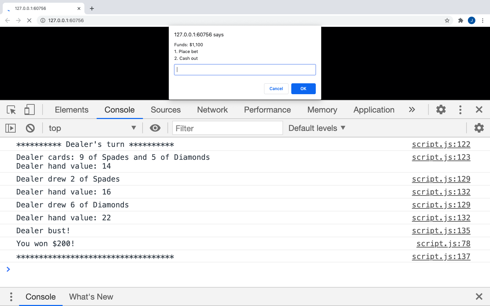

# Console-based Blackjack

## How to play

### Requirements:

- IDE - Visual Studio Code
- Live Server Extension for Visual Stuio Code
- Chrome browser

### Instructions:

1. Open the project folder using Visual Studio Code
2. Open <b>Termainl</b> -> <b>New Terminal</b>
3. Within the new terminal window type: `live-server` and press enter
4. Once the application is opened up in the broswer type `2` into the prompt window and press enter
5. Right click on the page window and select <b>Inspect</b>
6. Open the console window
7. Extend the console's window up to take two thirds of the page's vertical space
8. Refresh the page and you are now ready to play. Inputs are entered into the prompts and outputs will be displayed within the console window.

### Example of the game display

